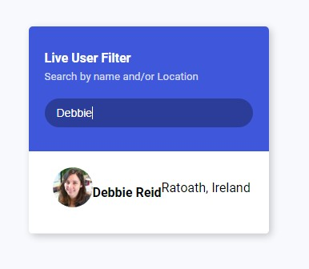
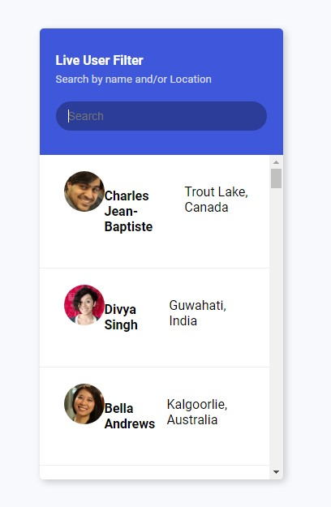

### Live Server Filter

- This is a Live Server Filter using HTML, CSS, JavaScript.
- This is just a Base version to filter the user by there name even with just one letter the filter process starts
- An API is used to fetch the random data of users with 50 users and then the filter process starts with the data
- simple project but main concept is to understand the JavaScript handler used to search and filter the person using name/Letter.
- These mention is used for Instagram , Faceboon, or other social media platforms to filter the names.

## Results

